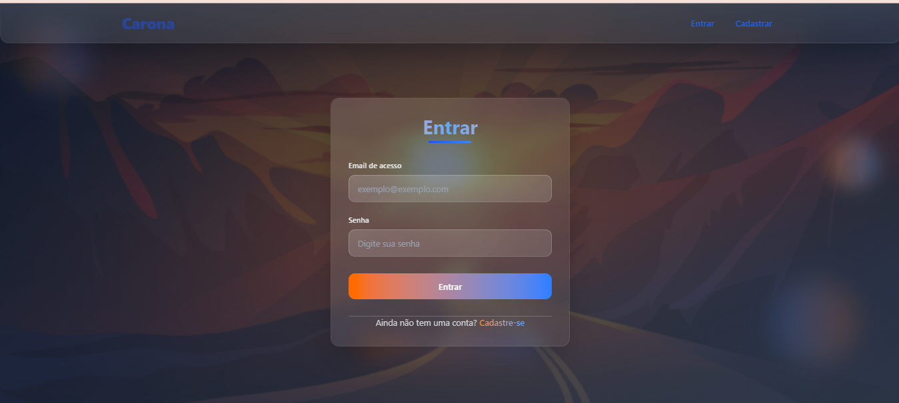
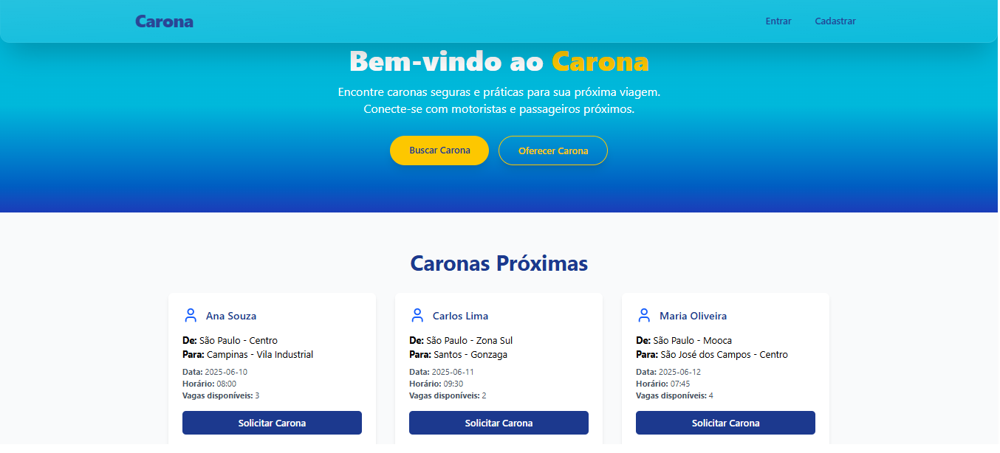
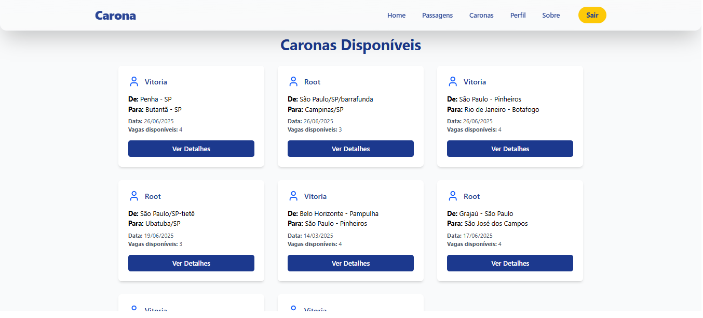
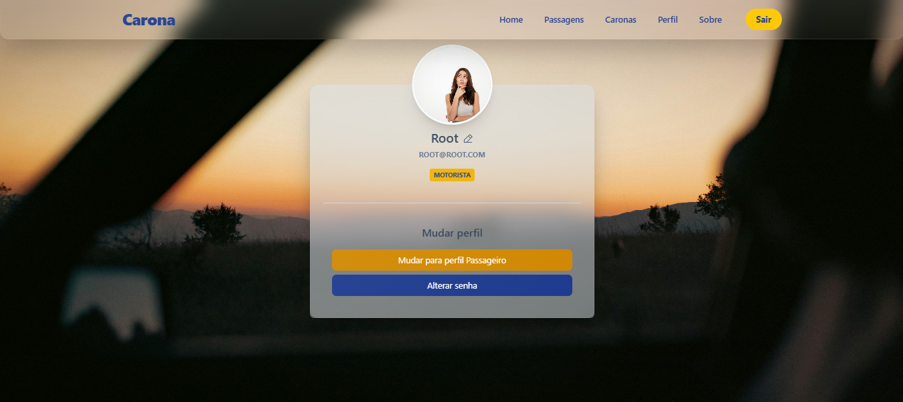
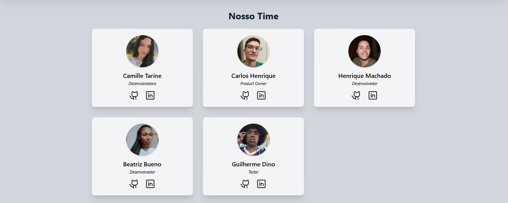

# 🚗 Carona - Mobilidade Colaborativa

## 📘 Introdução

O Carona nasceu com a missão de transformar o transporte urbano por meio da mobilidade colaborativa. Conectamos pessoas que compartilham trajetos semelhantes, reduzindo o número de carros nas ruas, economizando tempo e promovendo um futuro mais sustentável.

## 🎯 Objetivo

Criar uma plataforma acessível onde usuários possam se cadastrar como motoristas ou passageiros, criar e encontrar caronas com segurança, praticidade e consciência ambiental.

---

## 💻 Tecnologias Utilizadas

### 🛠️ Back-End:
- Java
- Spring Boot
- Spring Tools Suite (STS)
- MySQL
- PostgreSQL
- Render (deploy)
- Insomnia

### 💅 Front-End:
- HTML, CSS
- React
- Tailwind CSS
- TypeScript
- Axios
- React Router
- Vercel (deploy)

---

## 🌐 Link do Projeto (Deploy)

**Back-End (Swagger):** [Clique aqui pra conferir o swagger](https://aplicativo-carona-2.onrender.com)  
**Front-End (Vercel):** [Em breve...]

---

## 🖼️ Imagens do Projeto

- 
- 
- 
- 
- 

---

## 💡 Missão, Visão e Valores

**Missão:**  
Promover uma mobilidade mais inteligente, conectando pessoas que compartilham caminhos e valores, reduzindo o impacto ambiental.

**Visão:**  
Ser referência em mobilidade colaborativa no Brasil, tornando o ato de se locomover mais consciente, sustentável e acessível.

**Valores:**
- ♻️ Sustentabilidade
- 🤝 Colaboração
- 💡 Inovação
- 🛡️ Segurança
- 💖 Compromisso Social

---

## 🤝 Contribuições

Contribuições são super bem-vindas!  
Feedbacks e sugestões podem ser enviados pelas redes sociais do nosso time abaixo.

---

## 👥 Nosso Time

| Nome | Papel | GitHub | LinkedIn |
|------|-------|--------|----------|
| Camille Tarine | Desenvolvedora | [GitHub](https://github.com/CahTarine) | [LinkedIn](https://www.linkedin.com/in/camille-tarine/) |
| Carlos Henrique | Product Owner | [GitHub](https://github.com/Henrykeeh) | [LinkedIn](https://www.linkedin.com/in/carlos-henrique-da-silva-barbosa-no-linked-in/) |
| Henrique Machado | Desenvolvedor | [GitHub](https://github.com/scottineo) | [LinkedIn](https://www.linkedin.com/in/luiz-henrique-machado/) |
| Beatriz Bueno | Desenvolvedora | [GitHub](https://github.com/BeaKaylanee) | [LinkedIn](https://www.linkedin.com/in/beatriz-kailane-3513b5248/) |
| Guilherme Dino | Tester | [GitHub](https://github.com/meDinoo) | [LinkedIn](https://www.linkedin.com/in/guilherme-dino-pereira/) |

---

## 📄 Documentação Adicional

📑 [Clique aqui para baixar o escopo do projeto (PDF)](https://drive.google.com/uc?export=download&id=16LRie7NVny_rfNj46r5s-CV2IiII50Ju)

---

> 🌍 Cada carona importa. Conecte, compartilhe e transforme o mundo com a gente!
